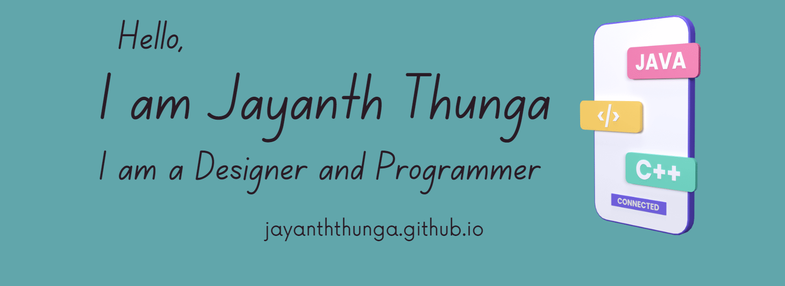

<!--  -->

<h1 align="center">Hi 👋, I'm Jayanth Thunga</h1>
<h3 align="center">I'm a designer and programmer in my pre-final year at VIT, Vellore. I seek to create light, aesthetic and minimalistic webpages. My webpages are designed with a focus on simplicity. I have experience in designing landing pages, logos and more.</h3>

  

- 🌱 I’m currently learning **Full stack Development**

- 👨‍💻 All of my projects are available at [https://jayanththunga.github.io/](https://jayanththunga.github.io/)

- 💬 Ask me about **Java, Brand design, Front end design, Data structures and Algorithms**

- 📫 How to reach me **jayanththunga27@gmail.com**

<h3 align="left">Connect with me:</h3>

<h3 align="left">Languages and Tools:</h3>

             

<!-- 

 -->

&nbsp;

